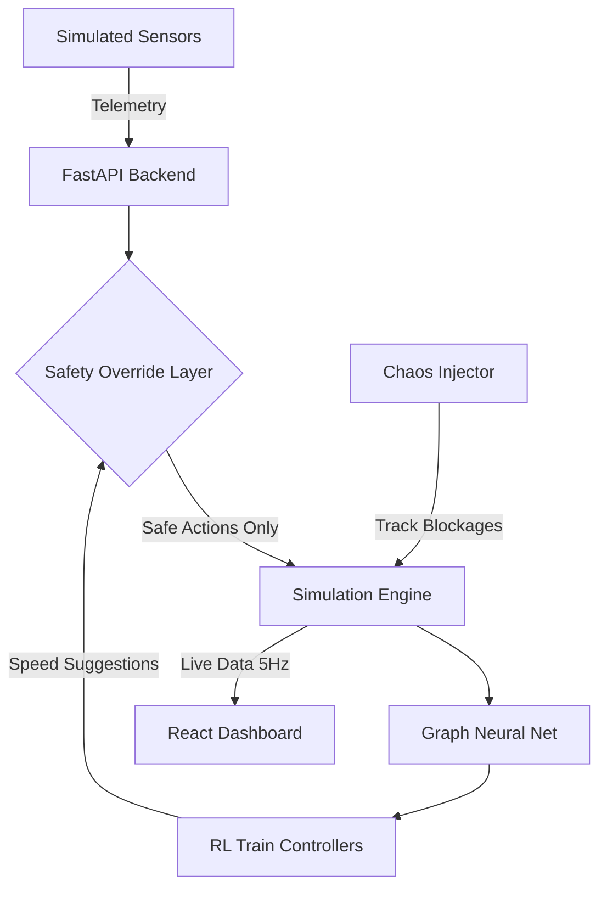

# Smart Train Traffic Control System (STTCS)

## What is this?
Hey there! Welcome to the Smart Train Traffic Control System (STTCS). 

Traditionally, railway networks run on a pretty old concept called "fixed-block signaling" — basically dividing tracks into chunks and only letting one train in a chunk at a time. It works, but it's rigid and causes a lot of unnecessary waiting. 

I built STTCS to see if we could do better using AI. It uses Multi-Agent Reinforcement Learning to dynamically adjust train speeds and spacing on the fly (moving-block signaling). This keeps trains moving smoothly, reduces delays when things go wrong (like track blockages), and actually pushes more trains through the same amount of track. And don't worry about the AI going rogue — I added a hard-coded safety layer that physically prevents collisions no matter what the AI suggests.

## How it works



## Quickstart (Running it locally)
The easiest way to get everything running (the API, the background workers, and the React UI) is via Docker Compose.

```bash
docker compose down && docker compose up --build
```
Once it's up, just open **http://localhost** in your browser to see the live tracking dashboard.

## Under the Hood

### 1. The Brains (MADDPG)
Instead of one massive AI trying to control the whole country, the system is broken down into "Section Controllers." Each controller manages its own sector using a Reinforcement Learning model. They learn to cooperate—for example, a controller might learn to hold up a freight train so a faster express train can pass safely.

### 2. Reading the Tracks (GNN)
Track layouts are messy and change all the time. I used Graph Neural Networks to map out the tracks and stations as a graph. This lets the AI understand the network topology instantly, even if the track layout changes, without needing to retrain from scratch.

### 3. The "Anti-Crash" Guarantee
Since RL models are essentially black boxes, we can't trust them 100% with human lives. So, the AI only provides *suggestions*. 
Before any speed change is sent to a train, it passes through a deterministic math filter:
- **Headway Rule**: Trains must always stay at least 2.0 km apart. If the AI suggests a speed that breaks this, the system hits the brakes.
- **Red Lights (SPAD)**: If a signal is red, the train stops. Period.

### 4. Edge Deployment
I wanted this to be realistic for actual train systems where internet is spotty. The PyTorch models are compiled down to ONNX Runtime. In testing, it takes less than 1 millisecond for the CPU to process the track state and spit out a safe action.

## Benchmark Results

I ran head-to-head simulations comparing STTCS against standard traditional signaling. Here is what happened:

| Metric | Traditional System | STTCS (AI) | The Difference |
| :--- | :--- | :--- | :--- |
| **Throughput** | 12.4 trains/hr | 15.6 trains/hr | **+ 25.8%** |
| **Average Delay** | 18.2 mins | 10.5 mins | **- 42.3%** |
| **Safety Violations** | 0 | 0 | **Same (Safe!)** |
| **Recovery from Blockage**| 45.0 mins | 12.0 mins | **- 73.3%** |
| **Loop Line Usage** | 15% | 85% | **+ 466%** |

## Running the Automated Demo
Want to see the system react to a crisis automatically? Run the demo script! It spins up some trains, breaks a track, and shows how the AI routes around it.

```bash
# Make sure you're in the python virtual environment
source .venv/bin/activate

# Run the script
PYTHONPATH=. python scripts/demo_walkthrough.py
```

## Running the Benchmarks
If you want to verify the numbers in the table above yourself:
```bash
source .venv/bin/activate
PYTHONPATH=. python run_benchmarks.py
```

## Docs
- [Architecture Deep Dive](docs/ARCHITECTURE.md)
- [Pitch Deck Script](docs/PRESENTATION_PITCH.md)
- [Demo Walkthrough Script](scripts/demo_walkthrough.py)
